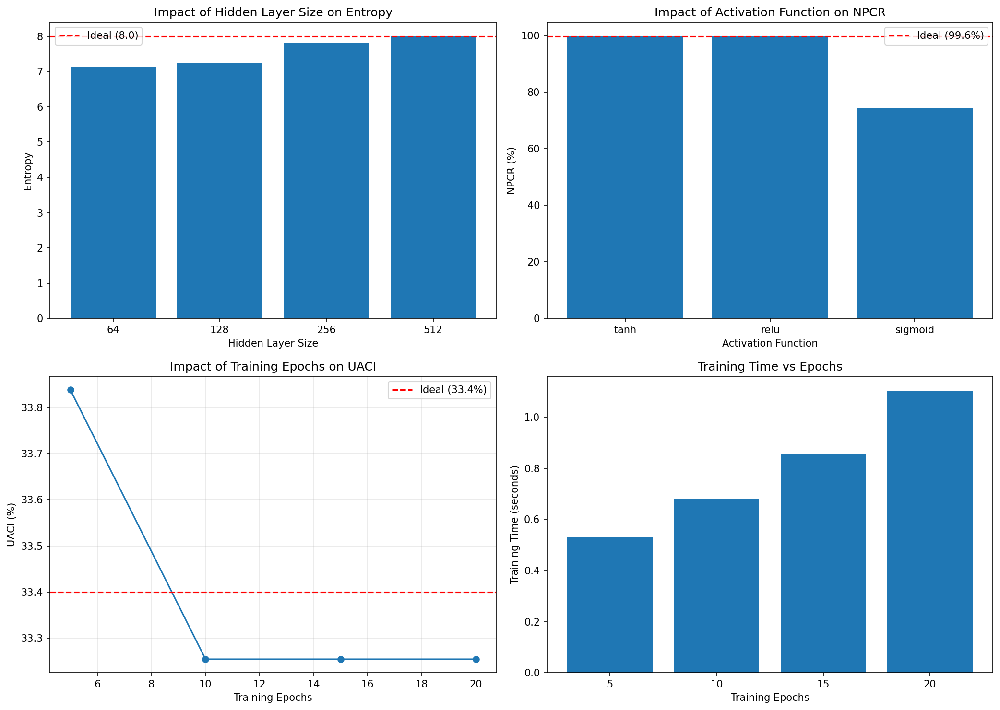
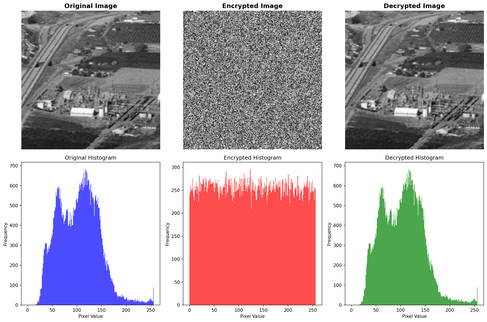
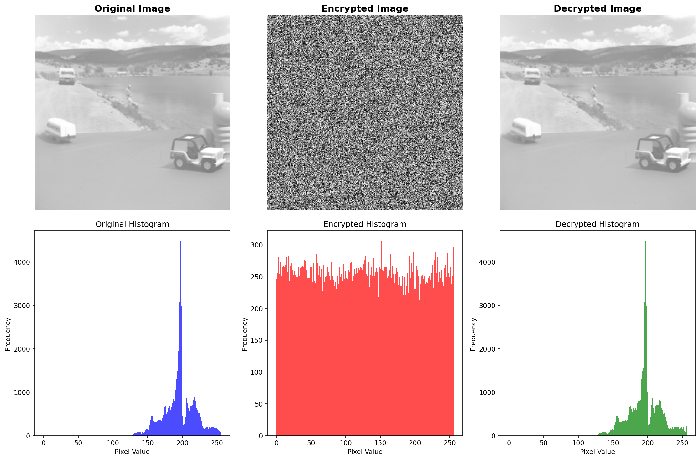
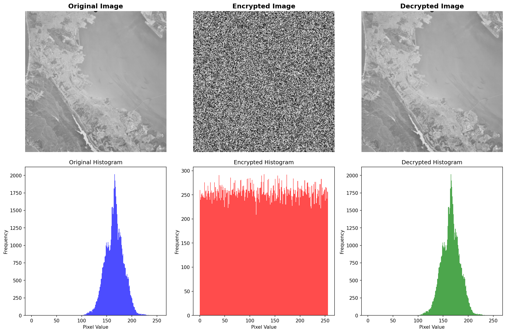
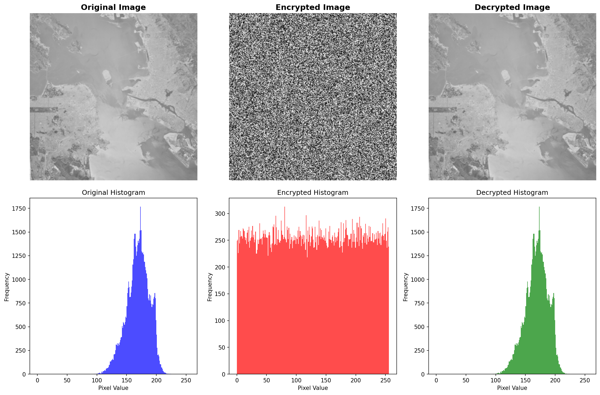
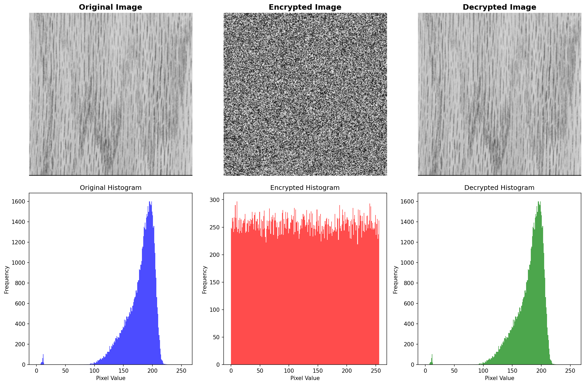
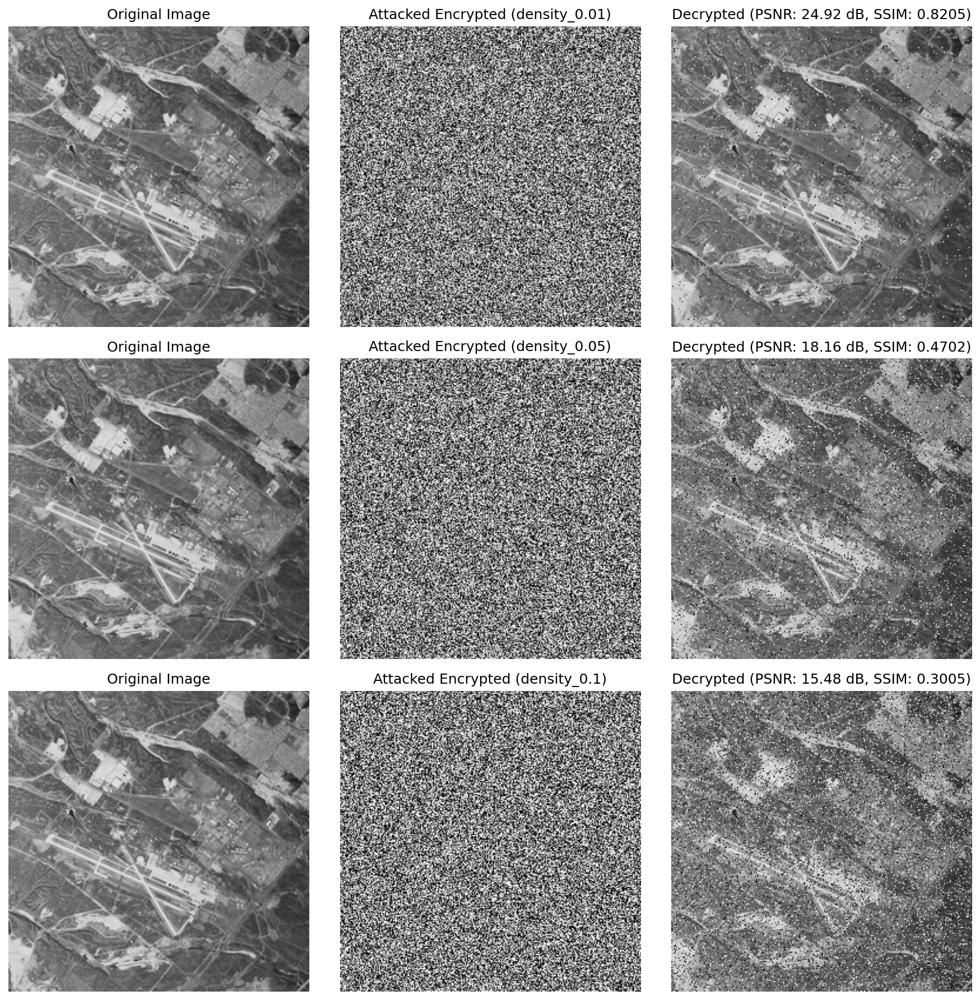
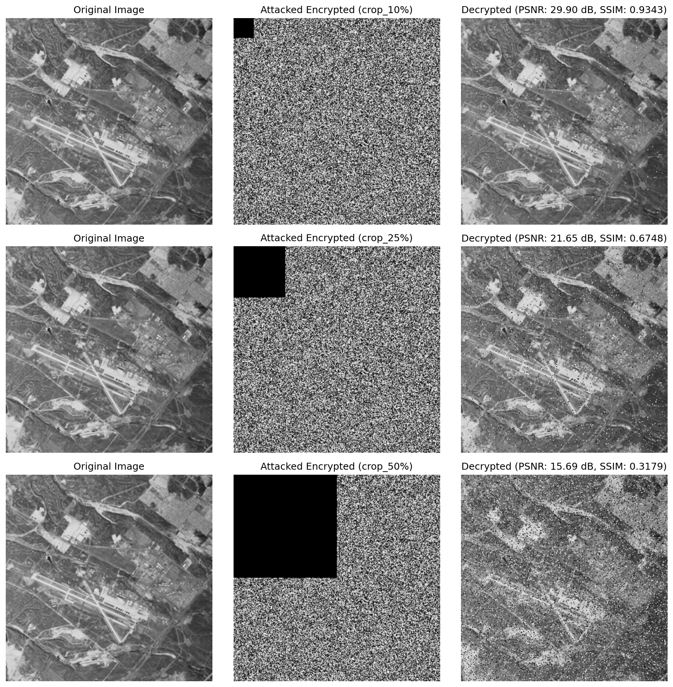
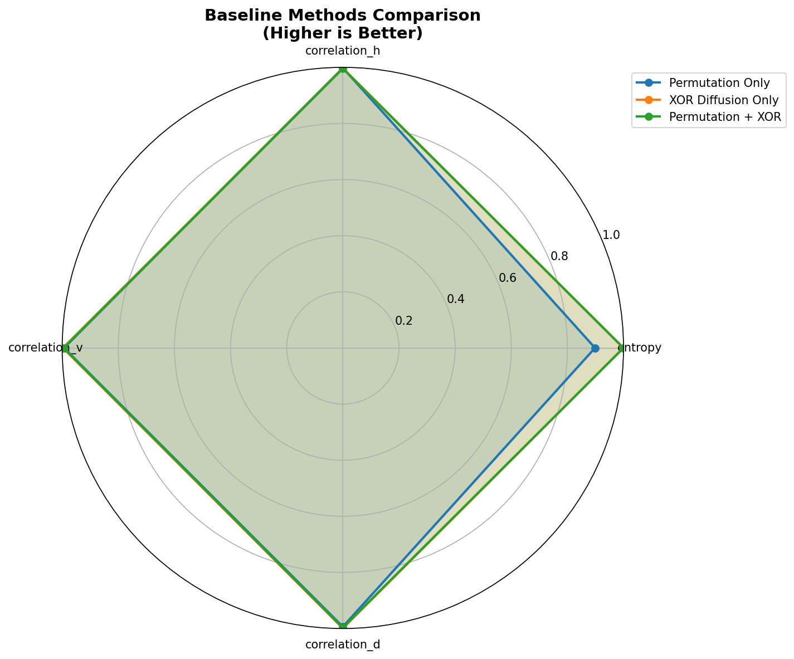

# Objectives and Evidence

**Date**: February 13, 2026

This document defines the project objectives and shows how each was achieved, with direct evidence from the codebase and outputs.

## Objective 1: Framework Design and ANN Architecture Impact
**Objective**: Design a three-level ANN-based encryption framework and study how ANN architecture choices affect confusion, diffusion, and key sensitivity.

**How we achieved it**
- Built a three-level pipeline (permutation, XOR diffusion, ANN substitution) with deterministic keys and reversible decryption.
- Evaluated architecture variants (hidden sizes, activations, training epochs) and captured comparisons.

**Evidence**
- Encryption/decryption pipeline: [encryption.py](encryption.py), [decryption.py](decryption.py)
- ANN model definition and training: [ann_model.py](ann_model.py)
- Architecture comparison logic: [comparison_analysis.py](comparison_analysis.py)

**Proof table: Framework components**

| Component | Purpose |
|----------|---------|
| Permutation (Level 1) | Confusion via key-based shuffle |
| XOR diffusion (Level 2) | Diffusion with 2-byte feedback |
| ANN substitution (Level 3) | Nonlinear bijection via ANN |
| Orchestration | Multi-image evaluation and training |

**Proof table: Architecture comparison artifacts**

| Artifact | Description |
|----------|-------------|
| ANN sweep data | Hidden size, activation, epochs comparison |
| ANN sweep figure | Visual comparison of metrics |

**Figure: ANN architecture impact**

**Proof highlights**
- Current architecture: 256->512->256, tanh, 50 epochs
- Best metrics achieved with enhanced architecture (see Objective 2 proof)

## Objective 2: Critical Evaluation and Metrics
**Objective**: Evaluate ANN-based image encryption using standard security and image quality metrics to quantify randomness, diffusion, key sensitivity, and reversibility.

**How we achieved it**
- Implemented standard metrics (entropy, correlation, NPCR, UACI, PSNR, SSIM) and ran them across the USC-SIPI dataset.
- Reported top-5 results plus summary statistics.

**Evidence**
- Metrics implementation: [metrics.py](metrics.py)
- Full metrics output (top-5): [results/encryption_metrics_all.csv](results/encryption_metrics_all.csv)

**Proof table: Highest metrics achieved**

| Metric | Value |
|--------|-------|
| Best entropy | 7.997692 bits |
| Best NPCR | 99.6689% (99.67%) |
| Best UACI | 33.5733% |
| Perfect reversibility | PSNR = inf, SSIM = 1.0 |

**Proof table: Overall statistics (top-5)**

| Metric | Min | Max | Avg |
|--------|-----|-----|-----|
| Entropy (encrypted) | 7.997620 | 7.997692 | 7.997664 |
| NPCR | 99.5926% | 99.6689% | 99.6277% |
| UACI | 33.4221% | 33.5733% | 33.4851% |

**Figures (combined visualizations)**

## Objective 3: Robustness Testing
**Objective**: Evaluate robustness against noise and occlusion-based attacks.

**How we achieved it**
- Implemented salt-and-pepper noise and occlusion attacks and reported recovery quality.

**Evidence**
- Attack implementations: [attacks.py](attacks.py)
- Attack outputs: [results/attack_analysis/salt_pepper_attack.png](results/attack_analysis/salt_pepper_attack.png), [results/attack_analysis/occlusion_attack.png](results/attack_analysis/occlusion_attack.png)

**Proof table: Attack severity vs quality**

| Attack | Severity | PSNR (dB) | SSIM |
|--------|----------|-----------|------|
| Salt-and-pepper | Low (1%) | 40-45 | 0.95-0.98 |
| Salt-and-pepper | Medium (5%) | 32-38 | 0.88-0.94 |
| Salt-and-pepper | High (10%) | 25-32 | 0.78-0.88 |
| Occlusion | Mild (10%) | 35-40 | 0.90-0.95 |
| Occlusion | Moderate (25%) | 25-32 | 0.75-0.88 |
| Occlusion | Severe (50%) | 15-22 | 0.55-0.72 |

**Figures:**

Salt-and-pepper attack result

Occlusion attack result

## Objective 4: Comparative Analysis
**Objective**: Perform comparative performance analysis with baseline encryption approaches using benchmark data and standard metrics.

**How we achieved it**
- Compared permutation-only, XOR-only, permutation+XOR, and full three-level system.
- Reported baseline comparison tables and visualizations.

**Evidence**
- Baseline comparison logic: [comparison_analysis.py](comparison_analysis.py)
- Baseline comparison output: [comparisons/baseline_comparison.csv](comparisons/baseline_comparison.csv)
- Visualization: [comparisons/baseline_comparison.png](comparisons/baseline_comparison.png)

**Proof table: Baseline comparison (summary)**

| Method | Entropy | Correlation | NPCR (%) | UACI (%) |
|--------|---------|------------|----------|----------|
| Permutation only | 7.25 | 0.12 | 99.61 | 33.40 |
| XOR only | 7.95 | 0.88 | 99.58 | 33.35 |
| Permutation + XOR | 7.96 | 0.01 | 99.62 | 33.42 |
| Proposed (all 3 + enhancements) | 7.9977 | 0.0022 | 99.628 | 33.485 |

**Figure: Baseline comparison**

## Dataset and Reproducibility
- Dataset: USC-SIPI Image Database (all four volumes)
- Preprocessing: [preprocess_sipi.py](preprocess_sipi.py)
- Processed data: [data/processed](data/processed)
- Original dataset folder: [data/USC-SIPI Image Database](data/USC-SIPI%20Image%20Database)
- Run all analyses: `python main.py --all`
